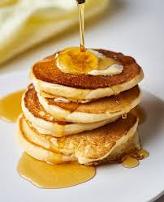

# Descrição
A proposta deste projeto é criar uma máquina capaz de cozinhar panquecas americanas de maneira totalmente automática. 

Para isso, a linha de produção pode ser dividida em:
1. Escolha de características pelo cliente (tempo de cocção, c/s manteiga, c/s mel)
2. Pagamento
3. Dispenser de massa
4. Etapa de cocção
5. Dispenser de manteiga
6. Dispenser de mel

## Etapas 1 e 2
Podemos fazer uma interface com um mini display oled e botões, conectados à um micro-controlador. Para o pagamento, podemos disponibilizar um qr-code com pix e algum serviço para que o micro-controlador seja notificado quando o pagamento é feito.

## Etapas 3 e 4

A ideia que eu encontrei para essas etapas está [neste vídeo](https://www.youtube.com/watch?v=dNELQhixK8Q), se você quiser ter uma noção melhor de como funciona o interior desta máquina, assista a [este vídeo](https://www.youtube.com/watch?v=MyI_Mnsbyio). 
## Etapas 5 e 6
Podemos fazer uma extrusora de manteiga sólida com um fio de metal que passa no bico para o corte.

Podemos usar uma [bomba peristáltica](https://www.youtube.com/watch?v=Asa6miVcUKA) para dispensar o mel. 

# MVP e Estimativa de Custos
O MVP deste projeto é simplesmente fazer uma máquina que consiga dispensar a massa e assar as panquecas, ou seja, apenas as etapas 3 e 4 da linha de produção, não havendo opção de pagar, escolher características e nem colocar manteiga e mel. Este MVP resolveria a etapa mais complicada e provaria a viabilidade técnica do projeto.

entre os materiais necessários estão:
- A esteira pode ser feita de mantas de teflon como [esta]([https://www.magazineluiza.com.br/manta-de-teflon-sem-adesivo-para-laminadora-008-30x100cm-nano/p/hkc6g16fh9/pi/mpsu/?seller_id=paintcoloroficial&srsltid=AfmBOorXvi27vQ1rfx5TqClVNYeVaXlli7HoGM2PeuAnxU9WyTiZPQmLRK0](https://www.mercadolivre.com.br/manta-teflon-p-sublimacao-assadeira-no-forno-60x40-cm/up/MLBU3434980353?matt_tool=18956390&utm_source=google_shopping&utm_medium=organic&pdp_filters=item_id%3AMLB5733758744&from=gshop). (4x26 = R$104)
- Existem vários tipos de resistência que podem ser utilizadas (mantas térmicas, resistências tubulares ou resistências de fogareiro). Os valores variam muito, mas acredito que é possível compras as mais baratas por cerca de 150 - 300 reais para o projeto inteiro.
- A parte aquecida pode ser feita com chapas de aço de 1mm (~R$ 100)
- 2 termopares (~R$60)
- motores DC com redução (~R$150)
- Fonte AC/DC (não é usada pela resistência). (~R$20)

Falta pensar em um  mecanismo para dispensar a quantidade certa de massa.
Esses componentes saem em torno de R$ 650, mas adicionando toda estrutura, que pode ser feita com chapas de metal, parafusos e partes impressas, um microcontrolador, ventoinhas, relés, etc, acredito que o valor final chegue próximo aos R$1200 - 1400.

# Relevância

A relevância desse projeto está principalmente na diminuição de custos, na higiene, na padronização e na busca por experiências de consumo tecnológicas como forma de atrair clientes e gerar um empreendimento lucrativo.

## Redução de custos
- minimiza o custo de mão de obra
- permite operar o empreendimento 24/7, ideal para aeroportos, terminais rodoviários, etc.
## Praticidade, higiene e padronização
- Produção das panquecas totalmente sem contato humano, mais buscado depois da pandemia.
- As panquecas estão prontas em questão de minutos, elas podem ser servidas em bandejas de papel e comidas com a mão. 
- As panquecas sempre terão as mesmas características

# Possíveis desafios

- Encontrar uma maneira de refrigerar a massa
- Dispensar exatamente a mesma quantidade de massa
- Encontrar uma receita de massa que possa ser armazenada por pelo menos um dia sem compromenter o produto final.
- Controlar a temperatura das chapas durante o processo.
